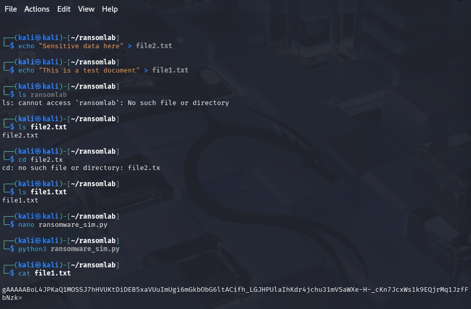
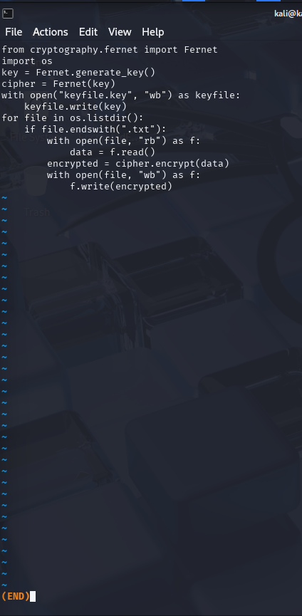
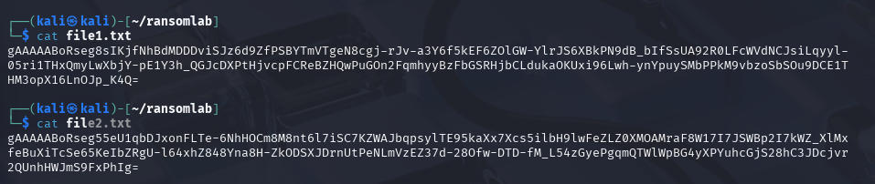
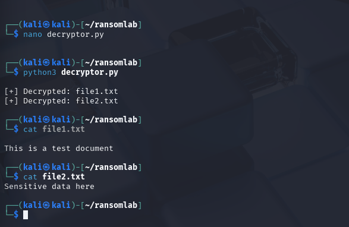

# 🛡️ Bypassing Ransomware Simulation (Educational Project)

This cybersecurity project simulates a basic **ransomware attack** and how to respond to it. It's designed as part of a hands-on learning experience to better understand how encryption-based ransomware operates, how it affects file systems, and how forensic response can be carried out if a key is recovered.

> ⚠️ **Disclaimer**: This simulation is for **educational** purposes only. Do **NOT** deploy ransomware techniques in any unauthorized environment.

---

## 🎯 Project Objective

- Simulate how a ransomware attack encrypts files using symmetric encryption.
- Understand the implications of ransomware on file integrity and user access.
- Develop a recovery script to reverse the encryption if the key is available.
- Practice basic Linux command-line operations and Python scripting.
- Enhance investigative and incident response skills using tools like `strings` and `auditd`.

---

## 📦 Tools & Technologies Used

- 🐍 Python 3
- 🔐 `cryptography` module (Fernet symmetric encryption)
- 🖥 Kali Linux in VirtualBox
- 📁 Linux file system and CLI utilities
- 🧠 Basic cyber forensic analysis

---

## 🔧 Prerequisites

Ensure the following are installed on your Kali VM:

```bash
sudo apt update
sudo apt install python3 python3-pip
pip3 install cryptography
```

---

## 🗂 Project Setup

1. **Create the Working Directory**

Open your terminal and set up a new lab folder:

```bash
mkdir ~/ransomlab
cd ~/ransomlab
```

2. **Create Sample Files**

To simulate user documents, create a few text files:

```bash
echo "This is a test document" > file1.txt
echo "Sensitive data here" > file2.txt
```

These `.txt` files will serve as the "victims" of the ransomware.

📸 


---

## 💣 Simulating the Ransomware

3. **Run the Ransomware Script**

Place the `ransomware_sim.py` in the working folder and execute it:

📸 

```bash
python3 ransomware_sim.py
```

✅ This script:

- Generates a symmetric encryption key using Fernet.
- Encrypts every `.txt` file in the directory.
- Overwrites original contents with encrypted versions.
- Saves the key to `keyfile.key` (simulate attacker keeping the key).

🔍 Post-execution, try opening the `.txt` files — they should display unreadable, garbled text.

📸 

---

## 🔍 Investigating the Attack

To begin your forensics process:

4. **Analyze the Script with `strings`**

```bash
strings ransomware_sim.py
```

This will output all readable strings in the script, allowing forensic teams to identify functions like `Fernet.generate_key()` or the presence of keywords like `encrypt`.


5. **Check the Key File**

Inspect the contents of `keyfile.key` to confirm the encryption key:

```bash
cat keyfile.key
```

This file represents what an attacker might use to demand a ransom. If recovered, it allows decryption.

---

## 🔓 Decryption and Recovery

6. **Use the Decryptor Script**

Run the `decryptor.py`:

```bash
python3 decryptor.py
```

✅ This script:

- Loads the Fernet key from `keyfile.key`.
- Decrypts each `.txt` file back to its original content.

📸 

---

## 🛡️ Hardening & Detection

7. **Monitor with `auditd`**

To simulate detection measures:

```bash
sudo apt install auditd
sudo auditctl -w /home/kali/ransomlab -p war -k ransomware
```

This command configures Linux auditing to watch the folder and report any **write/access/remove** operations.

Check the logs:

```bash
sudo ausearch -k ransomware
```

📸 _Screenshot Tip: Include auditd installation and usage steps._

---

## 📘 Key Learning Points

- **Ransomware** is designed to block access to data by encrypting files and demanding payment.
- If the **encryption key** is recovered, files can be decrypted.
- Early detection, logging, and monitoring are critical in stopping ransomware early.
- Linux tools (`auditd`, `strings`, etc.) aid in incident response and reverse engineering.

---

## 🔄 Suggested Extensions

- Expand file targets beyond `.txt`, e.g., `.pdf`, `.jpg`
- Add logging features or ransom note simulation
- Integrate network traffic monitoring using `Wireshark` or `tcpdump`

---

## 📁 Folder Structure

```
bypassing-ransomware-simulation/
├── ransomware_sim.py
├── decryptor.py
├── keyfile.key
├── file1.txt
├── file2.txt
├── screenshots/
│   ├── step1-setup.png
│   ├── step2-sim.png
│   ├── step3-encrypted.png
│   ├── step4-strings.png
│   ├── step5-decrypted.png
│   ├── step6-auditd.png
```

---

## 📸 Add Screenshots

Place PNG screenshots in the `screenshots/` folder to demonstrate each major step. These will enhance your GitHub portfolio.

---

## 👤 Author

Created as part of a hands-on cybersecurity simulation for my GitHub portfolio. Inspired by AIG's Virtual Experience Program and TryHackMe projects.
